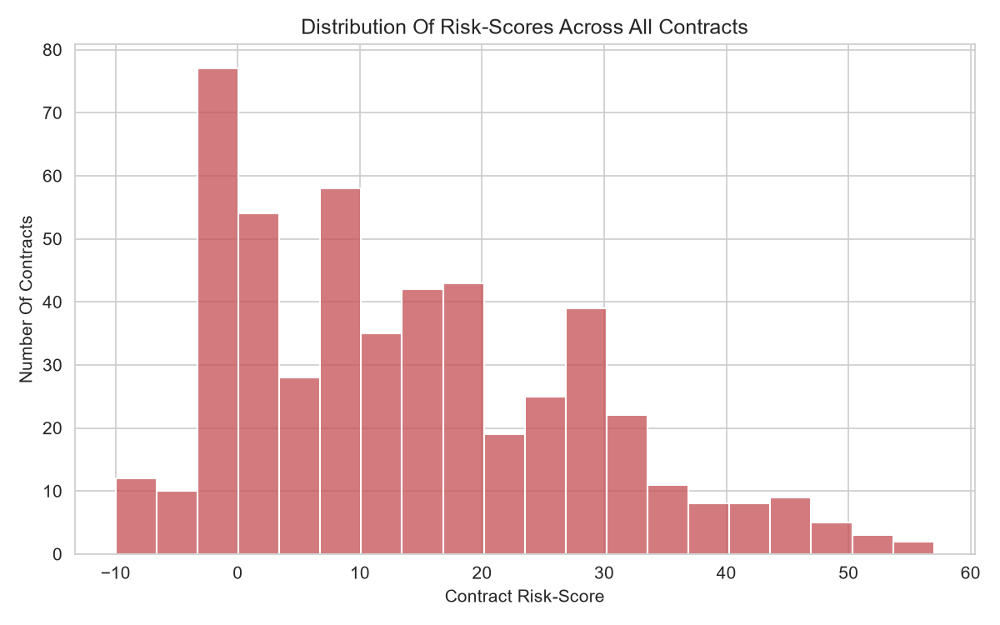
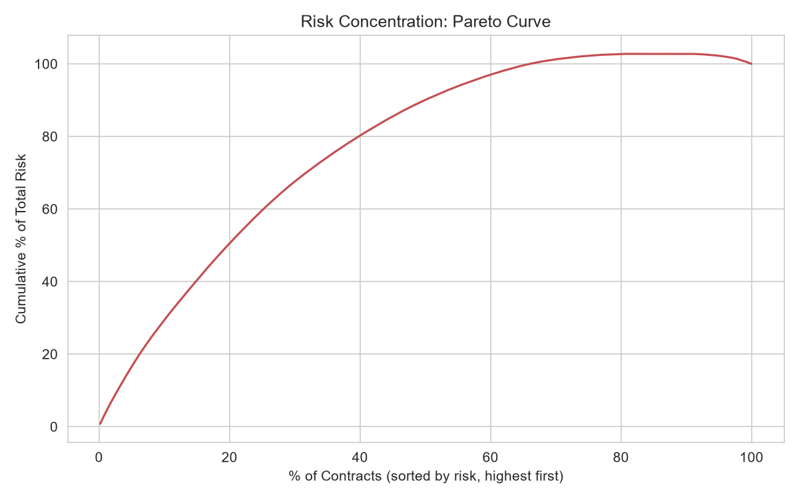
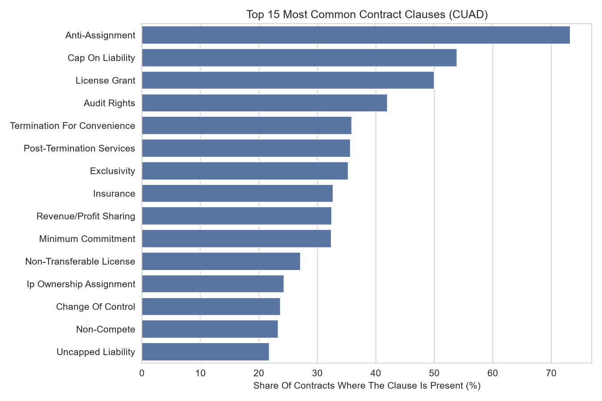
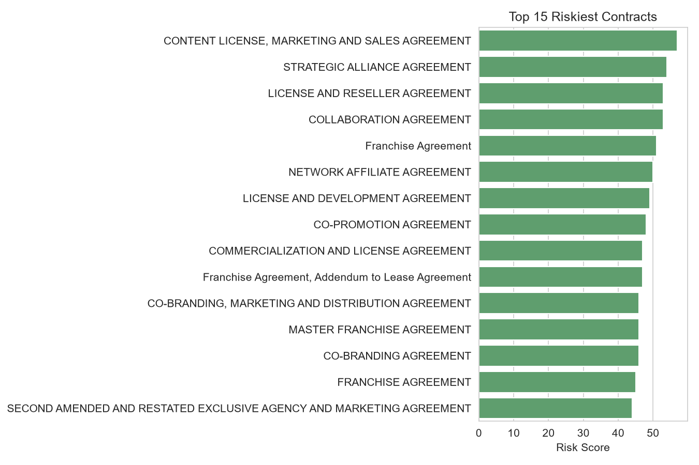

# Contract Risk Scoring
### Prioritizing legal review of commercial contracts using clause-level risk indicators

**[Live Dashboard](https://contractriskscoring.streamlit.app/)**
---

## Key Takeaway

Reviewing every contract with equal depth wastes limited legal capacity. Analysis of 510 real commercial contracts shows
risk is highly concentrated: the top 15 contracts (3% of the portfolio) carry an average risk score **3.8x higher** than
the rest of the sample, and just the **top 10% of contracts by score account for 29.3% of total portfolio risk**. Two 
clauses - **Uncapped Liability** and **Non-Compete** - are reliably elevated in high-risk contracts despite being 
relatively rare overall (present in ~22–23% of contracts, but in 80–100% of the highest-risk group), making them useful 
early triage flags.

**Recommendation:** prioritize legal review using the risk score, and treat the presence of Uncapped Liability or 
Non-Compete as an early flag worth a closer look — even before a full score is calculated. This lets a legal/compliance 
team focus limited review time where risk actually concentrates, instead of spreading it evenly across the portfolio.



---

## Business Context

Companies signing dozens or hundreds of commercial contracts cannot give each one an equally in-depth legal review. As a
result, contracts with dangerous terms (uncapped liability, exclusivity, volume restrictions, etc.) sometimes get the 
same attention as routine NDAs, and legal risk quietly accumulates. This project builds a lightweight, transparent 
prioritization model - a risk score - that a legal or compliance team can use to identify which contracts need priority 
review.

---

## Key Findings

**1. Risk is concentrated in a small group of contracts, not evenly distributed.**
The average risk score across the full sample was **14.1** (max: 57, for a Content License, Marketing and Sales 
Agreement). The top 15 highest-risk contracts (under 3% of the sample) averaged **49.1** — 3.8x higher than the 
remaining 495 contracts (13.0). Only 43.7% of contracts scored above the sample average, meaning the average is pulled 
up by a small number of outliers rather than reflecting a typical contract. Looking at the full distribution rather than
just the top 15: the **top 10% of contracts by score account for 29.3% of total portfolio risk**.
*Implication: reviewing all 510 contracts equally is inefficient — prioritizing by score concentrates review time where 
risk actually lives.*



**2. Uncapped Liability and Non-Compete are reliably elevated in high-risk contracts - not the most common clauses.**
Uncapped Liability appears in only 21.8% of contracts overall, but in 80.0% of the top-15 highest-risk contracts (3.7x 
more often). Non-Compete shows an even stronger pattern: 23.3% overall vs. 100.0% in the top 15 (4.3x more often). 
Notably, neither ranks in the top 10 most frequent clauses overall - unlike Anti-Assignment (73.3%) or License Grant 
(50.0%), which are common but not discriminative, appearing in high-risk and routine contracts alike. I checked this 
pattern isn't an artifact of the specific top-15 cutoff by re-running it at top-25 and top-30: Non-Compete stays 
consistently elevated (4.2–4.3x) across all three window sizes, while Uncapped Liability is more moderate but still 
consistently 3x+ above baseline.
*Implication: the presence of Uncapped Liability or Non-Compete can be used as a fast triage flag, even before a full 
risk score is calculated.*




**3. A complementary check - ranking clauses by lift rather than raw frequency gap - surfaces additional candidates for 
early red flags.**
Lift measures how many times more often a clause appears in the high-risk group relative to its overall base rate, which
rewards rare-but-concentrated clauses more than the frequency-gap view above. By this measure, the strongest signals are
**Third Party Beneficiary** (6.5% overall → 40.0% in the top 15, 6.2x), **Source Code Escrow** (2.5% → 13.3%, 5.3x), and
**Liquidated Damages** (12.0% → 60.0%, 5.0x). These clauses are rarer than Uncapped Liability or Non-Compete, so they 
contribute less to any single contract's total score, but their presence is disproportionately concentrated in the 
highest-risk contracts - worth treating as secondary flags alongside the two primary indicators above.

**4. Grouping contracts into score-based tiers gives an operational review framework.**
Splitting the sample into quartiles by risk score produces four tiers: **Low** (135 contracts, avg. score −1.1), 
**Medium** (130, avg. 7.5), **High** (119, avg. 17.7), and **Critical** (126, avg. 33.7). A legal/compliance team could 
route Critical-tier contracts for review first, Low-tier through standard/fast-track processing, without relying on a 
single arbitrary top-N cutoff.

---

## Data & Methodology

**Dataset:** [CUAD (Contract Understanding Atticus Dataset)](https://www.atticusprojectai.org/cuad) - 510 commercial 
contracts from SEC EDGAR filings, annotated by practicing attorneys across 40 labeled clause categories. Licensed under 
CC BY 4.0.

**Approach:**
1. Flag the presence/absence of each of the 40 clause categories per contract.
2. Calculate each clause's frequency across the full sample.
3. Assign each clause category a risk weight from 1-10, based on its potential legal/financial consequence for the 
signing party (e.g. Uncapped Liability: 10; Governing Law: default weight). A score of 0 represents a contract with no 
flagged clauses at all; negative scores indicate contracts where protective clauses outweigh risky ones - this is 
intentional, not an error.
4. Compute each contract's risk score as the sum of weights of the risky clauses present.
5. Visualize the distribution and flag the highest-risk contracts; cross-check the clause-level findings across multiple
top-N window sizes and against an alternative (lift-based) ranking.

**Limitations (by design, at this stage):**
- Contracts are drawn from public SEC filings of publicly traded US companies — the sample is not representative of 
private or non-US businesses.
- Risk weights are expert-assigned based on legal/compliance judgment, not statistically derived - this is an 
expert-based model, not machine learning, by deliberate choice at this stage.
- 81 contracts (15.9% of the sample) have partially redacted text for individual clauses.
- The top-15 cutoff used for the headline finding is a small group (3% of the sample), so single-clause percentages 
there move in ~6.7-point increments; findings were checked against top-25 and top-30 to confirm they aren't an artifact 
of that specific cutoff.
- Several contracts are tied on risk score right at the top-15 boundary; the script breaks ties deterministically 
(by contract name) so results are reproducible across runs and environments.
- Risk scores can be negative by design - protective clauses (e.g. liability caps) subtract from score, so a negative 
total reflects a net-protective contract, not an error.  

**Tools:** Python, Pandas, NumPy, Matplotlib/Seaborn.

---

## Roadmap / Next Steps

- Replace expert-assigned weights with weights statistically derived from historical contract dispute/loss data, if 
available.
- Add contract type classification (NDA, license, M&A, etc.) and compare risk profiles across types.
- Validate weights with input from 2-5 practicing lawyers to reduce model subjectivity.
- Add an NLP module to surface risk-relevant language not yet captured by the labeled clause categories.

---

## How to Run

```bash
git clone https://github.com/JuliaZimenina/Contract_Risk_Scoring.git
cd Contract_Risk_Scoring
pip install -r requirements.txt
# Download CUAD_v1_master_clauses.csv from:
# https://www.kaggle.com/datasets/theatticusproject/atticus-open-contract-dataset-aok-beta
# and place it in data/raw/
python risk_analysis.py
```

---

## About the Author

Julia Zimenina - Data Analyst with 10+ years of experience in legal and compliance (banking, energy, healthcare, 
manufacturing, agriculture), now applying that domain expertise and analytical mindset to data. 
This project reflects how I approach analysis: start from a real business problem, stay honest about a model's 
limitations, check whether findings hold up under different assumptions, and translate results into a recommendation 
someone can act on.

**[LinkedIn](https://www.linkedin.com/in/julia-zimenina/)**
